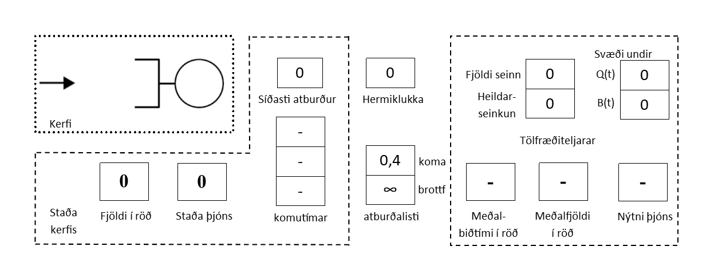

# Sýnidæmi: Hermun á biðraðakerfi í banka

Í þessu sýnidæmi er hermun framkvæmd á afgreiðslu í banka með eina röð og einn þjónustufulltrúa.
Markmið er að reikna út meðalbiðtíma í röð, meðalfjölda í röð og nýtni þjónustufulltrúa.

## Lýsing á kerfi

Við höfum eftirfarandi upplýsingar:

- **Einfalt biðraðakerfi**: Röð og einn þjónustufulltrúi.
- **Markmið mælinga**:
    - Reikna meðalbiðtíma í röð.
    - Ákvarða meðalfjölda í röð.
    - Meta nýtni þjónustufulltrúa.

Við herma um `n` viðskiptavini og byrjum með „tómt-og-í-bið“ stöðu þar sem enginn viðskiptavinur er
í kerfinu og þjónustufulltrúi er ekki að vinna.

---

## Aðferð við mælingar

### Meðalbiðtími í röð

Til að meta meðalbiðtíma þarf að safna biðtíma fyrir hvern viðskiptavin, skilgreindur sem `Di`.
Meðaltalið er reiknað sem:

$$d(n) = \frac{D_1 + D_2 + \dots + D_n}{n}$$

### Meðalfjöldi í röð

Fjöldi í röð yfir tíma `Q(t)` er teiknaður á móti tíma. Heildarsvæðið undir ferlinum deilt með
heildartíma gefur meðalfjölda í röð:

$$\text{Meðalfjöldi í röð} = \frac{\int Q(t) dt}{\text{Heildartími}}$$

### Nýtni þjónustufulltrúa

Nýtni er metin með því að skoða hlutfall tímans sem þjónustufulltrúi er virkur:

$$\text{Nýtni} = \frac{\text{Virkniþáttur}}{\text{Heildartími}}$$

---

## Framsetning á kerfinu

### Fyrsta viðmiðunarmæling: Biðröð $Q(t)$

.png)

Biðröð $Q(t)$ teiknar allar komur og brottfarir viðskiptavina þar til 5 viðskiptavinir hafa
yfirgefið kerfið.

### Önnur viðmiðunarmæling: Þjónn $B(t)$

.png)

Þjónn $B(t)$ lýsir stöðu þjónustufulltrúa:

- $B(t) = 1$: Þjónustufulltrúi er upptekinn.
- $B(t) = 0$: Þjónustufulltrúi er laus.

### Samspil $B(t)$ og $Q(t)$

+B(t).png)

Samspil $B(t)$ og $Q(t)$ gefur heildarfjölda í kerfinu á hverjum tíma.

---

## Upphafsstilling og framvinda

### Upphafsstilling

Kerfið er ræst í stöðunni "tómt-og-í-bið". Slembiframkallari ákvarðar næstu komutíma $A_1$ og
vinnslu $D_1$.

- $A_1 = 0.4$: Fyrsti komutími.
- $D_1 = \infty$: Fyrsti brottfaratími verður reiknaður þegar viðskiptavinur kemur í kerfið.

### Framvinda

Hermiklukkan hoppar í næsta atburð:

#### Tími = 0.4: Fyrsta koma

- Viðskiptavinur fer beint í þjónustu.
- Næsti komutími $A_2 = 1.6$.
- Fyrsti brottfaratími $D_1 = 2.4$.

#### Tími = 1.6: Önnur koma

- Viðskiptavinur fer í biðröð.
- Næsti komutími $A_3 = 2.1$.

#### Tími = 2.4: Fyrsta brottför

- Viðskiptavinur í biðröð fer í þjónustu.
- Heildarbiðtími uppfærður.

---

## Niðurstöður

Eftir að 6 viðskiptavinir hafa farið í gegnum kerfið eru niðurstöðurnar sem hér segir:

| Stiki                  | Reikniaðferð                          | Niðurstaða |
|------------------------|---------------------------------------|------------|
| Meðalbiðtími í röð     | Heildarseinkun / fjöldi viðskiptavina | 0.95       |
| Meðalfjöldi í röð      | Svæði undir $Q(t)$ / hermiklukka    | 1.15       |
| Nýtni þjónustufulltrúa | Svæði undir $B(t)$ / hermiklukka    | 0.90       |

---

## Ítarefni

- [MathWorks: What is Discrete Event Simulation?](https://www.mathworks.com/videos/understanding-discrete-event-simulation-part-1-what-is-discrete-event-simulation--1494873178760.html)
- [MathWorks: Why Use Discrete Event Simulation?](https://www.mathworks.com/videos/understanding-discrete-event-simulation-part-2-why-use-discrete-event-simulation--1494968753758.html)
- [MathWorks: Leveraging Stochastic Processes](https://www.mathworks.com/videos/understanding-discrete-event-simulation-part-3-leveraging-stochastic-processes-1494968826974.html)
- [MathWorks: Operations Research](https://www.mathworks.com/videos/understanding-discrete-event-simulation-part-4-operations-research-1494968860649.html)

