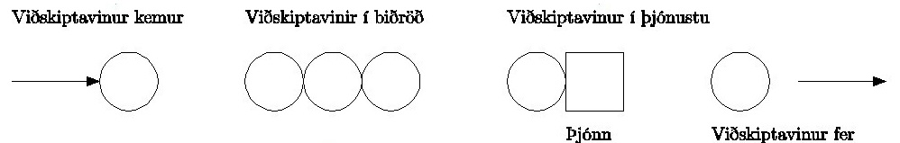
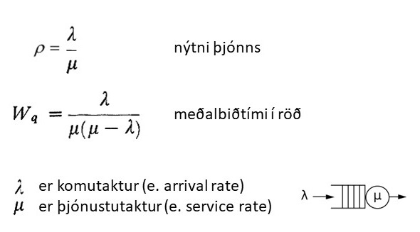
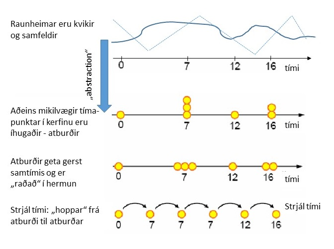
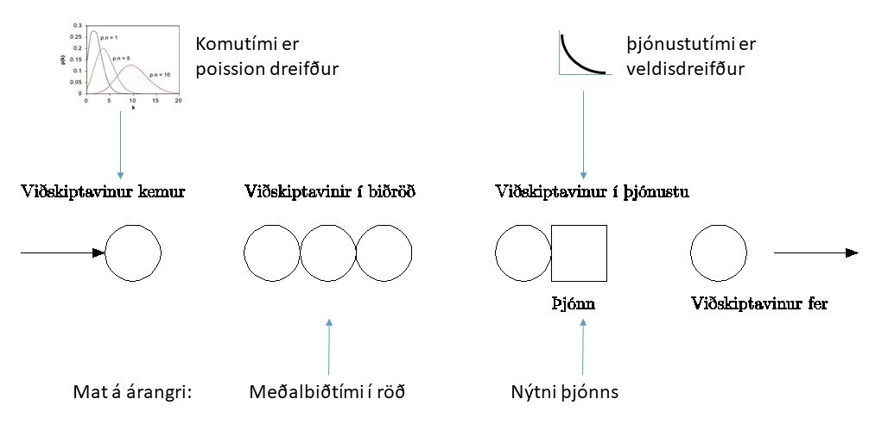
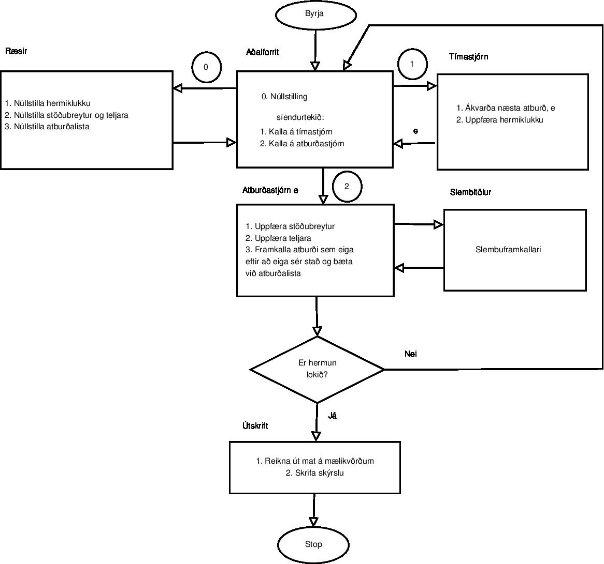

# Stakræn atburðahermun

Stakræn atburðahermun er tegund hermunar þar sem orsakasamhengi er þekkt, hægt er að lýsa kerfinu
sem ferli, ástandsbreytur kerfis breytast skyndilega vegna atburðar (e. event) í endanlegum fjölda
tímapunkta.

Einfalt slíkt kerfi væri t.d. biðraðakerfi með einn þjón sem afgreiðir og eina biðröð sem
viðskiptavinir fara í til að bíða eftir þjónustu. Koma viðskiptavina í röðina er háð tölfræðilegri
dreifingu. Þjónustutími hjá þjóni er háð tölfræðilegri dreifingu. Spurningar sem væri verið að
svara með því að skoða svona kerfi væru t.d. að meta á meðalbiðtíma í röð (þjónustutími ekki talinn
með) eða að meta nýtni þjóns.

Kerfi sem hafa _Poisson_ dreifingu á komu viðskiptavina (þ.e. veldisdreifing á millikomutíma) og
veldisdreifingu á þjónustutíma þjóns eru kölluð `M/M/1`. Fyrsta `M`-ið er dreifing komu
viðskiptavina, `M` stendur fyrir _Markovian_ (eða veldisdreifing), annað `M`-ið er
þjónustutímadreifing og 1 stendur fyrir
fjölda þjóna (`M/M/1/∞` þar sem síðasta talan er hámarkslengd raðar, notum óendanlegt ef ekkert
hámark). Þessi framsetning býður einnig upp á:

- `G`: almenn dreifing (e. general),
- `D`: löggeng dreifing (e. deterministic),
- og skipta má `1` út fyrir `K`: fjölda þjóna (1 til margir).

Þessi nafnagift á biðraðakerfi er kölluð _Kendall_ nafnagift (e. Kendall notation). Á `M/M/1` kerfi
er
hægt að gera nákvæma greiningu.

Kerfi sem hægt er að greina nákvæmlega (e. analytic solutions) eru ekki mörg, sjá töflu hér að
neðan:

| Kendall | Koma viðskiptavina | Röð | Fjöldi þjóna | Þjónustutími   | Nákvæm lausn |
|---------|--------------------|-----|--------------|----------------|--------------|
| `M/M/1` | Poisson            | 1   | 1            | Veldisdreifing | Já           |
| `M/G/1` | Poisson            | 1   | 1            | Almenn         | Já           |
| `M/M/K` | Poisson            | 1   | K            | Veldisdreifing | Já           |
| `M/G/K` | Poisson            | 1   | K            | Almenn         | Nei          |
| `G/G/1` | Almenn             | 1   | 1            | Almenn         | Nei          |
| `D/M/1` | Löggeng            | 1   | 1            | Veldisdreifing | ?            |
| `M/D/1` | Poisson            | 1   | 1            | Löggeng        | ?            |

---

## Þættir stakrænna atburðahermilíkana

Stakræn hermun skoðar líkan af raunheimi á ákveðnum tímapunktum. Samfelldum tíma raunheims er varpað
í stakrænan tíma þar sem atburðir eru skoðaðir. **Einingar** (e. entities / work items) er það sem
flæðir í gegnum kerfið. Einingar eru unnar á vinnustöðvum (e. servers / work center). Þessi breyting
fer fram í atburðum (e. events). Sem sagt, allar breytingar kerfisins eru tengdar atburðum. Atburðir
taka engan tíma í framkvæmd (e. instantaneous) og eru heilir (e. atomic), þ.e. annar atburður getur
ekki truflað, sameinast eða vafist inn í annan atburð. Til að meta kerfið er árangurstiki reiknaður
fyrir sérhvern atburð. Meðhöndlun tíma er sérstaklega mikilvæg til að skilja ferlið.

### Tímavörpun

Hin raunverulegi heimur er túlkaður í atburði.

Þessir atburðir gerast á ákveðnum rauntíma. Til að geta meðhöndlað atburði þarf hermivél (e.
simulation engine) að raða þeim í röð (e. serialize). Hermivél þarf að fara í gegnum alla atburði í
réttri röð. Þessi nálgun felur í sér að tími fer úr því að vera samfelldur yfir í strjálan tíma.

### Innviðir hermilíkana

Til að hægt sé að útskýra virkni stakrænnar atburðahermunar þarf að útskýra nokkur hugtök:

| Íslenska         | Lýsing                                   | Enska               |
|------------------|------------------------------------------|---------------------|
| **Eining**       | Hlutur sem unnið er með í hermun.        | Entity / work       |
| **Eiginleikar**  | Upplýsingar sem geyma má með einingum.   | Attributes          |
| **Vinnustöð**    | Staður þar sem unnið er með einingar.    | Server / station    |
| **Aðföng**       | Þættir sem eining þarf til vinnslu.      | Resources           |
| **Biðröð**       | Rými þar sem eining bíður eftir vinnslu. | Queue               |
| **Atburður**     | Breyting sem gerist í kerfi.             | Event               |
| **Árangurstiki** | Mæling á árangri kerfis.                 | Performance measure |

Þegar framkvæma á hermun á líkani með stakrænni atburðhermun þarf að halda utan um einingar, atburði
og árangur. Vinnustöðvum er raðað upp þannig að þær líki eftir líkani af raunheimum. Við hverja
vinnustöð eru aðföng sem geta verið starfsfólk, efni, orka og þar fram eftir götunum. Árangurstikar
eru settir á viðeigandi staði, t.d. ílag vinnustöðvar, vinnslu hennar eða frálag hennar.
Ferli einingar í gegnum vinnustöðvar er ákveðið. Ákveða þarf hvenær einingar fara inn í kerfi sem og
hvenær unnið er við einingarnar. Þetta er gert með atburðum. Atburðir hafa tölfræðilega dreifingu.
Sumt í kerfinu er löggengt, t.d. biðröð fyrir framan vinnustöð eykur tíma í kerfinu en er ekki
tölfræðilega dreifð. Finna þarf hvernig tölfræðileg dreifing er á komu eininga í kerfið sem og
vinnslu þeirra á sérhverri vinnustöð.

### Ílagsgögn

> Gögn sem notuð eru til að ákveða hvernig breytileiki kerfisins er.

Þetta kerfi hefur eina vinnustöð, einingin sem flæðir er viðskiptavinur og aðföng sem notuð eru
er þjónustufulltrúi. Fyrir framan vinnustöðina er biðröð. Svona kerfi hefur dreifingu á
komutíma sem og dreifingu á þjónustutíma. Ef kerfið er `M/M/1` þá er komutími $\lambda$ með Poisson
dreifingu og þjónustatími $\mu$ með veldisdreifingu.

Til að sannreyna þetta mætti mæling komutíma og þjónustutíma ítrekað og máta við viðeigandi
dreifingar. Árangursstikur væru tvær, önnur er meðalbiðtími og hin nýtni þjóns. Báðar þessar stikur
eru tímastikur.

Finna þarf hvernig einingar koma inn í kerfið og hvernig kerfið þjónustar einingar. Þetta þýðir að
finna þarf dreifingu á komu og dreifingu á vinnslu.

### Vinnsla hermivélar

Hermivél notar slembiframkallara (e. random generators) til að búa til keyrslu (e. instance). Þessi keyrsla er oft endurtekin (e. replicating) til að safna niðurstöðudreifingu sem er svo túlkuð. 

Hér að neðan er einföld skýring á því hvernig forritun hermivéla fyrir stakræna atburðahermun (SAL) er gerð og hvaða grunnþættir stakrænir atburðahermilíkön innihalda. Taflan útskýrir aðalhugtök hermunar:

| Íslenska            | Lýsing                                                  | Enska              |
|---------------------|---------------------------------------------------------|--------------------|
| **Stöðubreyta**     | Safn stöðubreytna sem lýsa kerfi á ákveðnum tímapunkti. | System state       |
| **Ræsir**           | Núllstillir hermilíkan og setur upphafsstöðu.           | Initialization     |
| **Hermiklukka**     | Breyta sem gefur ástand hermiklukku.                    | Simulation clock   |
| **Atburðalisti**    | Listi sem inniheldur næsta tíma þegar atburður á sér stað. | Event list         |
| **Tölfræðiteljarar**| Breytur sem halda utan um tölfræðilegar upplýsingar.     | Statistical counters |
| **Tímastjórn**      | Ákvarðar næsta atburð í atburðalista og færir hermiklukku að þeim tíma þegar atburður á sér stað. | Time routine       |
| **Atburðastjórn**   | Uppfærir stöðubreytur og tölfræðilega teljara þegar atburður gerist. Kallar á slembiframkallara til að bæta við atburðum í atburðalista. | Event routine      |
| **Slembuframkallarar** | Framkalla slembnar stærðir með því að nota líkindadreifingar. Ákveða næsta atburð. | Generate random variates |
| **Útskrift**        | Gefur tölfræðilegar upplýsingar um breytur sem við höfum skilgreint. | Output reports     |
| **Stöðvunarregla**  | Skilyrði um hvernig og hvenær á að stöðva hermun.        | Termination rule   |

### Ferli hermivélar

Ferli sem hermivél fer í gegnum við framkvæmd stakrænnar atburðahermunar má sjá á myndinni hér að neðan:

Ferlið felur í sér eftirfarandi skref:
1. **Upphafsstilling**: Hermilíkan er núllstillt og upphafsgögn sett.
2. **Atburðaskráning**: Atburðir eru skráðir og raðaðir í atburðalista.
3. **Tímastjórn**: Hermiklukka er færð að næsta atburði.
4. **Framkvæmd atburða**: Atburðir eru framkvæmdir í réttri röð.
5. **Útskrift og stöðvun**: Þegar stöðvunarreglu er náð, eru niðurstöður skráðar og túlkaðar.

Ýtarleg lýsing á þessu ferli má finna í bókinni [Law, 2007](#heimildir) á blaðsíðum 10–11.

### Frálagstúlkun

Niðurstöður hermilíkans samanstanda af setti niðurstaðna sem safnað er í gegnum margar keyrslur. Þetta sett þarf að greina og túlka. Túlkun felur í sér:
- Að skoða meðalúttak og dreifingu niðurstaðna.
- Að meta áreiðanleika líkanans með því að bera niðurstöðurnar saman við raunheim.

Frekari umfjöllun um túlkun niðurstaðna má finna í kafla um 
[frálagstúlkun](../results_interpretation/what_to_know.md).

# Heimildir

- **Law, A. M.** (2007). *Simulation Modeling and Analysis* (4th ed.). McGraw-Hill.
