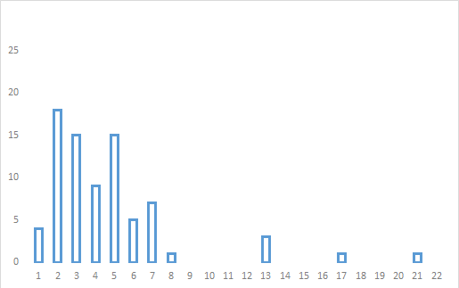
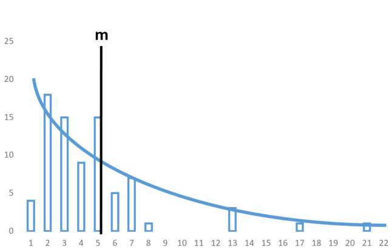
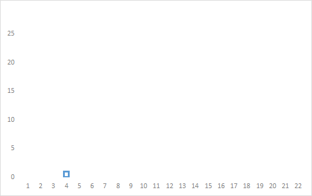
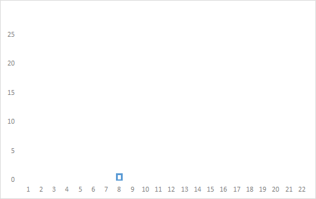

# Virkni stakrænnar atburðahermunar

Hermun er alltaf þegar spurning er varpað fram til að greina flækið í kerfi. Til þess
þarf að skilgreina mælistiku, keyra margar keyrslur og safna dreifingu á niðurstöðum
sem eru svo túlkaðar.

> Stakræn atburðahermun gerir kleift að skilgreina kerfi sem röð atburða og safna
> mælistikum til að greina virkni og skilvirkni kerfisins.

---

## Árangursmæling

Markmið allrar hermunar er að kanna einhverskonar árangur. Þegar hugtakamótun er framkvæmd,
er mæling á árangri kerfis lykilatriði sem þarf að skilgreina.

### Tegundir mælistika

Mælistikur eru:

- **Tímastikur**: Mælingar tengdar rauntíma, t.d. nýtni þjóns.
- **Úrtaksstikur**: Talningar sem eru ekki beint tengdar tíma, t.d. fjöldi ákveðinna atburða.

> **Skilgreining**: Markmið hverrar keyrslu er að fá eitt gildi per mælistiku, svo sem
> meðalbiðtíma í röð.

---

## Ein keyrsla fyrir eina niðurstöðu

Til að fá eina niðurstöðu pr. mælistiku er hermun keyrð. Dæmi: Biðraðakerfi með
`M/M/1` kerfi (einn þjónn og ein biðröð).

**Komutímar**: Skilgreindir sem vigrar sem innihalda millitíma milli atburða:

- Fyrsta stak: Millitími frá upphafi til fyrsta atburðar.
- Annað stak: Millitími milli fyrsta og annars atburðar.

> Millikomutímar eru því einfaldlega mismunurinn (e. difference) á tíma milli aðliggjandi atburða.

**Þjónustutímar** eru skilgreindir með sama hætti. Slembiröðun vigranna tryggir ólíkar
niðurstöður í hverri keyrslu.

> **Lykilatriði**: Samspil milli tveggja vigra — komutíma og þjónustutíma —
> gerir kleift að reikna biðraðir og aðrar frámælingar.

---

## Gerð tímavigra

Til að búa til tímavigra eru þó þrjú skref nauðsynleg:

### 1. Safna raungögnum

- Safna þarf gögnum um tíma milli atburða.
- Mælingarnar eru birtar sem histogram:

### 2. Meta dreifingu

- Nota þarf tól úr tölfræði til að meta hvaða dreifing passar best við gögnin.

### 3. Gera tímavigra

- Nota slembiframkallara til að framkalla vigrana með sömu eiginleikum og dreifingin sem mæld var.
- Útkoma slembiframkallara lýsir mismunandi niðurstöðum eftir hverju kalli:

---

## Margar keyrslur fyrir dreifingu

Til að fá áreianlega niðurstöðu eru keyrslur margítrekaðar. Slembni tryggir að
hver keyrsla skilar mismunandi gögnum.

> Fjöldi keyrslna ráðast af ákveðnum áreiðanleika- og nákvæmnisviðmiðum.

---

## Flækja

- **Hætta við (e. balking)**: Þegar eining fer ekki í röð.
- **Forgangsröðun (e. priority)**: Einingar hafa mismunandi forgang.
- **Skipti milli raða (e. jockeying)**: Einingar skipta á milli biðraða.

> Þessir þættir geta aukið flækjustig hermunar en eru mikilvægir í líkani sem lýsir raunverulegum
> kerfum.

