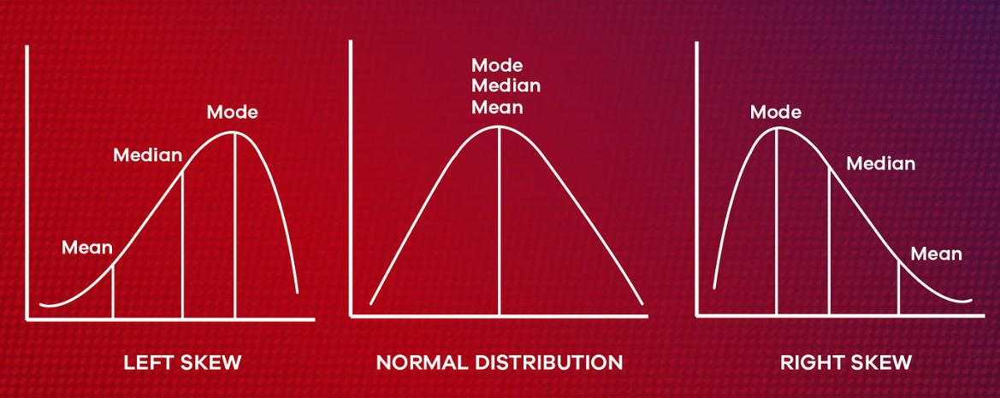

# Væntigildi, fervik og fylgni

## Væntigildi (e. expectation)

Væntigildi (e. mean or expected value) er mælikvarði á meðalgildi slembibreytu. Það er táknað
með $$\mu_i$$ eða $$E[X_i]$$ og skilgreint sem:

$$
\mu_i =
\begin{cases}
\sum_{j=1}^\infty x_j p_{X_i}(x_j), & \text{ef } X_i \text{ er strjál breyta} \\
\int_{-\infty}^\infty x f_{X_i}(x)dx, & \text{ef } X_i \text{ er samfelld breyta}
\end{cases}
$$

**Mikilvægir eiginleikar væntigildis:**

1. $$E[cX] = cE[X]$$
2. $$E[\sum_{i=1}^n c_iX_i] = \sum_{i=1}^n c_iE[X_i]$$, jafnvel þó að $$X_i$$ séu háð

> **Önnur mikilvæg hugtök:**
> - **Miðgildi (e. median)**: Gildi $$x_{0.5}$$ þar sem $$F_{X_i}(x_{0.5}) = 0.5$$.
> - **Algengasta gildi (e. mode)**: $$x$$ sem hámarkar $$f_{X_i}(x)$$ eða $$p_{X_i}(x)$$.



---

## Fervik (e. variance)

Fervik (e. variance) mælir dreifingu slembibreytu um meðalgildið hennar $$\mu$$. Það er táknað
með $$\sigma_i^2$$ eða $$\text{Var}(X_i)$$ og skilgreint sem:

$$
\sigma_i^2 = E\big[(X_i - \mu_i)^2\big] = E[X_i^2] - \mu_i^2
$$

> **Fervik sýnir hversu breytileg slembibreyta er í kringum meðalgildið sitt.**

**Eiginleikar ferviks:**

- $$\text{Var}(X) > 0$$
- $$\text{Var}(cX) = c^2 \text{Var}(X)$$
- Ef $$X_i$$ eru óháð, þá gildir:
  $$
  \text{Var}\Big(\sum_{i=1}^n X_i\Big) = \sum_{i=1}^n \text{Var}(X_i)
  $$

---

## Samdreifni úrtaks og fylgni (e. covariance and correlation)

> Samdreifni mælir hvernig tvær slembibreytur breytast saman.  
> Fylgni er staðlað mat á þessari tengingu.

Samdreifni (e. covariance) tveggja slembibreyta $$X$$ og $$Y$$ er skilgreind sem:

$$
\text{Cov}(X,Y) = E\big[(X - \mu_X)(Y - \mu_Y)\big] = E[X Y] - \mu_X\mu_Y
$$

Fylgni (e. correlation) er óhlutbundið mat á tengslum tveggja slembibreyta:

$$
\text{Cor}(X, Y) = \rho_{XY} = \frac{\text{Cov}(X, Y)}{\sigma_X \sigma_Y}
$$

> **Hvað þýðir jákvæð fylgni?**  
> Ef $$\text{Cor}(X, Y) > 0$$ þá eykst $$Y$$ þegar $$X$$ hækkar. Ef $$\text{Cor}(X, Y) < 0$$ þá
> lækkar $$Y$$ þegar $$X$$ hækkar.

### R dæmi um hermun á M/M/1 biðröð

```Rscript 
# Function to simulate an M/M/1 queue
simulate_mm1 <- function(mean_interarrival, mean_service, n_customers, seed = 42) {
  set.seed(seed)

  # Initialize vectors
  A <- numeric(n_customers + 1)  # Interarrival times
  S <- numeric(n_customers)  # Service times
  X <- numeric(n_customers + 1)  # Waiting times

  # Generate interarrival and service times using -mean * log(rand(1))
  for (i in 1:n_customers) {
    S[i] <- -mean_service * log(runif(1))  # Service time
    A[i + 1] <- -mean_interarrival * log(runif(1))  # Interarrival time
  }

  # Compute waiting times
  # Note, X[1] is initialized as 0, because there is no waiting time for the first customer
  for (i in 1:n_customers) {
    X[i + 1] <- max(X[i] + S[i] - A[i + 1], 0)
  }

  lambda <- 1 / mean_interarrival
  mu <- 1 / mean_service

  list(
    sim = tibble(
      customer = 1:n_customers,
      waiting_time = X[-1]  # Exclude first value since it's initialized as 0
    ),
    lambda = lambda,
    mu = mu,
    w_theoretical = 1 / (mu - lambda),
    num_customers = n_customers,
    scenario_label = paste0("lambda == ", round(lambda, 2), "~~~ mu == ", round(mu, 2))
  )
}
```

#### Reiknum fylgni á biðtíma

```Rscript
# Function to compute lagged correlation of waiting times
compute_correlation <- function(waiting_times, max_lag = 10) {
  n <- length(waiting_times)

  correlation_values <- numeric(max_lag + 1)

  for (j in 0:max_lag) {
    X_i <- waiting_times[1:(n - max_lag)]
    X_j <- waiting_times[(1 + j):(n - max_lag + j)]

    mu_i <- mean(X_i)
    mu_j <- mean(X_j)
    sigma2_i <- var(X_i)
    sigma2_j <- var(X_j)

    correlation_values[j + 1] <- (mean(X_i * X_j) - mu_i * mu_j) / sqrt(sigma2_i * sigma2_j)
  }

  tibble(lag = 0:max_lag, correlation = correlation_values)
}
```

#### Dæmi 4.19 úr Law (2007)

```Rscript
mean_interarrival <- 0.5;
mean_service <- 1;
rho <- mean_service / mean_interarrival;
sim_data <- simulate_mm1(mean_interarrival, mean_service, 1000)
corr_data <- compute_correlation(simdata$sim$waiting_times, 10)
```


---

## Jafnvægis-samfylgni (e. covariance-stationary)

Strjáll-tími slembiferli $$X_1, X_2, \ldots$$ er sagður vera í jafnvægis-samfylgni (e.
covariance-stationary) ef:

$$
\mu_i = \mu, \quad \sigma_i^2 = \sigma^2, \quad C_{i,i+j} = \text{Cov}(X_i, X_{i+j}),
$$

þar sem $$C_{i,i+j}$$ er óháð $$i$$ fyrir öll $$j$$.

> **Dæmi:**  
> Fyrir M/M/1 biðraðakerfi, ef fyrstu athuganir $$D_1, D_2, \ldots, D_k$$ eru fjarlægðar, þá getur
> ferlið orðið með jafnvægis-samfylgni eftir ákveðinn tíma.

### Upphitunartími

Í hermun á biðraðakerfum eins og M/M/1 getur ferlið byrjað í óstöðugu ástandi þar sem fyrstu
athuganir eru ekki fulltrúar stöðugrar hegðunar kerfisins. Þetta er kallað upphitunartími (e.
warm-up period).

- Warm-up tími vísar til þess tímabils þar sem kerfið er ekki enn komið í jafnvægi.
- Fyrstu mælingarnar í hermuninni geta verið skekktar vegna þess að kerfið byrjar í tómu ástandi eða
  öðrum upphafsskilyrðum sem hafa áhrif á niðurstöður.
- Þegar ákveðinn fjöldi fyrstu mælinga er fjarlægður ($$D_1, D_2, ..., D_k$$), þá hefur kerfið náð
  jafnvægis-samfylgni, sem þýðir að dreifing breytanna er stöðug yfir tíma.
- Þetta er gert til að tryggja að niðurstöður endurspegli langtímahegðun kerfisins.

---

## Mat á meðaltali, ferviki og fylgni

Óbjagað mat á úrtaksmeðaltali (e. sample mean) er gefið með:

$$
\bar{X}(n) = \frac{1}{n} \sum_{i=1}^{n} X_i
$$

þar sem $$\bar{X}(n)$$ er slembibreyta. Óbjagað mat þýðir að:

$$
E[\bar{X}(n)] = \mu
$$

svo að væntigildi úrtaksmeðaltalsins er jafnt raunverulegu meðalgildi $$\mu$$.

Til að meta hversu nálægt $$\bar{X}(n)$$ er sanna meðalgildinu, notum við fervik:

$$
\text{Var}[\bar{X}(n)] = \frac{\sigma^2}{n}
$$

Þetta sýnir að þegar $$n$$ eykst, minnkar fervik úrtaksmeðaltalsins, sem þýðir að matið verður
nákvæmara.

Óbjagað mat á ferviki er gefið með:

$$
S^2(n) = \frac{1}{n-1} \sum_{i=1}^{n} (X_i - \bar{X}(n))^2
$$

sem leiðir til mats á ferviki úrtaksmeðaltalsins:

$$
\widehat{\text{Var}}[\bar{X}(n)] = \frac{S^2(n)}{n}
$$

Ef úrtaksbreyturnar $$X_1, X_2, \dots$$ eru óháðar, þá er fylgnin núll. Hins vegar, í hermilíkönum
er oft fylgni á milli mælinga ($${\rho}_j > 0$$). Í þessu tilfelli er:

$$
E\bigg[\frac{S^2(n)}{n}\bigg] = \frac{\big[n/a(n)\big] - 1}{n - 1} \text{Var}[\bar{X}(n)]
$$

þar sem:

$$
a(n) = 1 + 2\sum_{j=1}^{n-1} \big(1 - j/n\big) \rho_j
$$

Ef $${\rho}_j > 0$$, þá gildir $$a(n) > 1$$ og því er:

$$
E\bigg[\frac{S^2(n)}{n}\bigg] < \text{Var}[\bar{X}(n)] = \frac{\sigma^2}{n}
$$

Þetta þýðir að úrtaksfervik er oft _vanmat_ á raunverulegu ferviki þegar breyturnar eru háðar,
en úrtak hermilíkana eru nánast _alltaf_ háð.

### Mat á fylgni

Fylgni milli mælinga $$X_i$$ og $$X_{i+j}$$ má meta með:

$$
\hat{\rho}_j = \frac{1}{S^2(n)} \sum_{i=1}^{n-j} \frac{(X_i - \bar{X}(n))(X_{i+j} - \bar{X}(n))}{n - j}
$$

Þetta mat á fylgni getur verið gagnlegt þegar unnið er með háðar mælingar, t.d. í hermilíkönum.

#### R kóði fyrir fylgnireikninga

```Rscript
# Reiknum fylgni fyrir mismunandi tímaskref
compute_autocorrelation <- function(X, max_lag = 10) {
  n <- length(X)
  mu <- mean(X)
  sigma2 <- var(X)
  rho <- numeric(max_lag + 1)

  for (j in 0:max_lag) {
    X_i <- X[1:(n - j)]
    X_j <- X[(1 + j):n]
    rho[j + 1] <- sum((X_i - mu) * (X_j - mu)) / ((n - j) * sigma2)
  }

  tibble(lag = 0:max_lag, correlation = rho)
}
```

Athugið að í fyrri útfærsla á fylgnireikningum hér að ofan var sérhæfð fyrir M/M/1 biðraðakerfi og
byggði á hermun, þar sem biðtímar voru greindir yfir tíma. Í þessari útfærslu er fylgni metin á
almennari hátt, án beinnar tengingar við biðraðakerfi, en með sömu undirliggjandi stærðfræðilegu
nálgun.

Munurinn felst í því hvernig gildin eru meðhöndluð:

- Í fyrra dæminu var `max_lag` notað til að tryggja að sami fjöldi mælinga sé notaður í hverjum
  útreikningi.
- Í þessari útfærslu er lengd úrtaksins skekkt í hverju skrefi með `n - j`, sem getur haft áhrif á
  matið á langtímafylgni.

Þetta sýnir hvernig ólíkar nálganir við mat á fylgni geta haft mismunandi áhrif á niðurstöður og
dregur fram mikilvægi þess að velja útreikninga sem hæfa því samhengi sem verið er að greina.