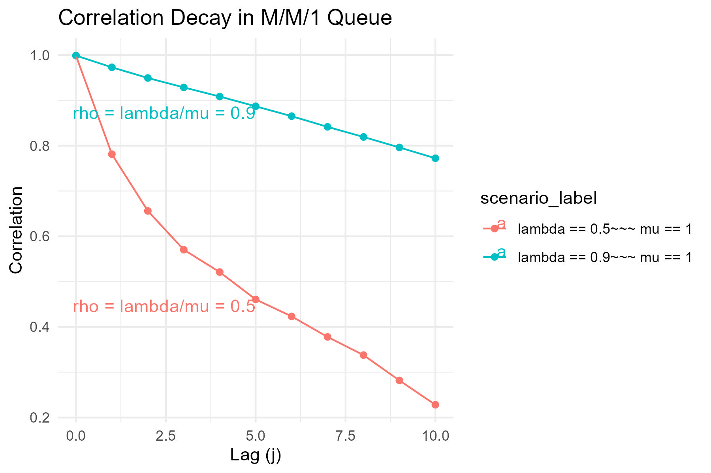

# Væntigildi, fervik og fylgni

## Væntigildi (e. expectation)

Væntigildi (e. mean or expected value) er mælikvarði á meðalgildi slembibreytu. Það er táknað
með $$\mu_i$$ eða $$E[X_i]$$ og skilgreint sem:

$$
\mu_i =
\begin{cases}
\sum_{j=1}^\infty x_j p_{X_i}(x_j), & \text{ef } X_i \text{ er strjál breyta} \\
\int_{-\infty}^\infty x f_{X_i}(x)dx, & \text{ef } X_i \text{ er samfelld breyta}
\end{cases}
$$

**Mikilvægir eiginleikar væntigildis:**

1. $$E[cX] = cE[X]$$
2. $$E[\sum_{i=1}^n c_iX_i] = \sum_{i=1}^n c_iE[X_i]$$, jafnvel þó að $$X_i$$ séu háð

> **Önnur mikilvæg hugtök:**
> - **Miðgildi (e. median)**: Gildi $$x_{0.5}$$ þar sem $$F_{X_i}(x_{0.5}) = 0.5$$.
> - **Algengasta gildi (e. mode)**: $$x$$ sem hámarkar $$f_{X_i}(x)$$ eða $$p_{X_i}(x)$$.

---

## Fervik (e. variance)

Fervik (e. variance) mælir dreifingu slembibreytu um meðalgildið hennar $$\mu$$. Það er táknað
með $$\sigma_i^2$ eða $$\text{Var}(X_i)$$ og skilgreint sem:

$$
\sigma_i^2 = E\big[(X_i - \mu_i)^2\big] = E[X_i^2] - \mu_i^2
$$

> **Fervik sýnir hversu breytileg slembibreyta er í kringum meðalgildið sitt.**

**Eiginleikar ferviks:**

- $$\text{Var}(X) > 0$$
- $$\text{Var}(cX) = c^2 \text{Var}(X)$$
- Ef $$X_i$$ eru óháð, þá gildir:
  $$
  \text{Var}\Big(\sum_{i=1}^n X_i\Big) = \sum_{i=1}^n \text{Var}(X_i)
  $$

---

## Samdreifni úrtaks og fylgni (e. covariance and correlation)

> Samdreifni mælir hvernig tvær slembibreytur breytast saman.  
> Fylgni er staðlað mat á þessari tengingu.

Samdreifni (e. covariance) tveggja slembibreyta $$X$$ og $$Y$$ er skilgreind sem:

$$
\text{Cov}(X,Y) = E\big[(X - \mu_X)(Y - \mu_Y)\big] = E[X Y] - \mu_X\mu_Y
$$

Fylgni (e. correlation) er óhlutbundið mat á tengslum tveggja slembibreyta:

$$
\text{Cor}(X, Y) = \rho_{XY} = \frac{\text{Cov}(X, Y)}{\sigma_X \sigma_Y}
$$

> **Hvað þýðir jákvæð fylgni?**  
> Ef $$\text{Cor}(X, Y) > 0$$ þá eykst $$Y$$ þegar $$X$$ hækkar. Ef $$\text{Cor}(X, Y) < 0$$ þá 
> lækkar $$Y$$ þegar $$X$$ hækkar.

### MATLAB dæmi um hermun á M/M/1 biðröð

```matlab
% M/M/1 Kerfi, dæmi 4.19
mean_interarrival = 0.5;
mean_service = 1;
rho = mean_service / mean_interarrival; % Hlutfallið rho
X(1) = 0; % Fyrsti viðskiptavinur þarf ekki að bíða

for i = 1:1000
    S(i) = -mean_service * log(rand(1)); % Þjónustutími
    A(i+1) = -mean_interarrival * log(rand(1)); % Millikomutími
    X(i+1) = max([X(i) + S(i) - A(i+1), 0]); % Biðtími
end
```

### Reiknum fylgni á biðtíma

```matlab
m = 10;
for j = 0:m
    X_i = X(1:end-m);
    X_j = X((1+j):end-m+j);
    mu_i = mean(X_i); sigma2_i = var(X_i);
    mu_j = mean(X_j); sigma2_j = var(X_j);
    rho(j+1) = (mean(X_i .* X_j) - mu_i * mu_j) / sqrt(sigma2_i * sigma2_j);
end
```



---

## Jafnvægis-samfylgni (e. covariance-stationary)

Strjáll-tími slembiferli $$X_1, X_2, \ldots$$ er sagður vera í jafnvægis-samfylgni (e.
covariance-stationary) ef:

$$
\mu_i = \mu, \quad \sigma_i^2 = \sigma^2, \quad C_{i,i+j} = \text{Cov}(X_i, X_{i+j}),
$$

þar sem $$C_{i,i+j}$$ er óháð $i$ fyrir öll $$j$$.

> **Dæmi:**  
> Fyrir M/M/1 biðraðakerfi, ef fyrstu athuganir $$D_1, D_2, \ldots, D_k$$ eru fjarlægðar, þá getur
> ferlið orðið með jafnvægis-samfylgni eftir ákveðinn tíma.

