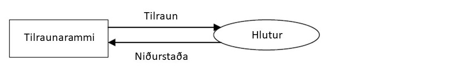

# Lausn vandamála með hermilíkani

Ein fyrsta tæknin sem menn notuðu til að læra og mögulega breyta umhverfinu var tilraun. Til dæmis
ef menn ætluðu að læra hversu mikla leir og vatn þyrfti í pottagerð, gerðu þeir tilraunir með
mismunandi blöndur þar til besta samsetningin fannst.

Tilraunir hafa alltaf verið mikilvægar í lausn vandamála. Í raunheimi má lýsa tilraun eins og í
eftirfarandi skýringarmynd:

---

## Takmarkanir á tilraunum í raunheimi

Það getur oft verið erfitt eða jafnvel ómögulegt að gera tilraunir á raunverulegum kerfum. Ýmis
takmörk geta komið í veg fyrir slíkar tilraunir:

- **Háan kostnað**: Tilraunir geta verið mjög dýrar í framkvæmd.
- **Tímafrekar tilraunir**: Sum kerfi krefjast langrar prófunartíma.
- **Áhættusamar prófanir**: Tilraunir gætu valdið skaða á raunverulegum kerfum.

Til að komast framhjá þessum takmörkunum höfum við þróað líkön sem leyfa okkur að framkvæma
tilraunir í tölvu. Með því að nota formleg líkön, eins og jöfnur sem lýsa hitaútbreiðslu (t.d.
Fourier-lögmálið), getum við reiknað út hvernig hitinn dreifist og prófað mismunandi uppsetningar
áður en þær eru notaðar í raunheimi.

Þetta breytir ferlinu úr einfaldri tilraun yfir í stærðfræðilegt líkan eins og sýnt er í næstu mynd:

---

## Vandamál með stærðfræðileg líkön

Þegar við notum stærðfræðileg líkön, rekumst við á ýmis vandamál:

- **Einfaldanir**: Oft þarf að einfalda kerfið til að fá lausn.
- **Óleysanlegar jöfnur**: Í sumum tilfellum eru jöfnurnar of flóknar til að leysa beint.
- **Óþekkt hegðun**: Líkanið þarf að passa við raunheimahegðun, annars eru niðurstöðurnar ónothæfar.

> **Við bætum við tölulegum aðferðum til að leysa jöfnur!**  
> Með því að nota tölvureikninga getum við unnið með flóknari líkön en ella.

Þetta bætir nýju lagi við ferlið, eins og sýnt er hér:

--- 

## Kostir hermunar

Hermun gerir okkur kleift að prófa mismunandi aðstæður án þess að hafa áhrif á raunverulegt kerfi.
Það hefur fjölmarga kosti:

- ✅ Hægt að prófa ákvarðanir í líkanaheimi án áhættu.
- ✅ Sama líkan er hægt að nota endurtekið með mismunandi breytum.
- ✅ Hermun krefst oft færri einfaldana en stærðfræðileg líkön.
- ✅ Reglur og hegðun í líkönum er auðvelt að breyta og prófa mismunandi aðstæður.
- ✅ Hægt að framkvæma tilraunir með mismunandi aðstæður áður en raunveruleg innleiðing fer fram.
- ✅ Notendur geta átt samskipti við hermilíkanið og greint viðbrögð þess.
- ✅ Styttri hönnunartími og minni fjárfesting í raunheimi áður en nýjar aðferðir eru prófaðar.
- ✅ Upphaflega kerfið verður ekki fyrir truflunum meðan hermunin er framkvæmd.

---

## Atburðarit

Atburðarit (e. event graphs) eru myndræn framsetning sem sýnir hvernig atburðir hafa áhrif á hvert
annað í stakrænni atburðahermun. Þau eru notuð til að skilja tímaröð og flæði atburða í kerfum og
geta hjálpað við að greina flöskuhálsa eða ósamræmi í kerfishönnun.

[Law (2007)](#heimildir) fjallar um þessa aðferð í kafla 1.4.7, og ítarefni má finna hjá [Buss
(2001)](#heimildir) og [Schruben (1983)](heimildir.md#schruben1983).

## Ferlalýsingar

Ferlalýsingar (e. process modeling) eru aðferð til að skilja, skjalfesta og greina ferli í
skipulagsheildum. Þær nýtast í aðferðarfræði sem snýr að því að hagræða og bæta ferla með því að
skrá flæði upplýsinga, ákvarðanir og samskipti á milli aðila.

Með ferlalýsingum er hægt að:

- Greina og auðkenna óskilvirkni í ferlum.
- Skilja samspil milli eininga innan kerfisins.
- Hanna betri og markvissari vinnuferli.

Slíkar lýsingar nota formleg táknmál eins og flæðirit, BPMN (Business Process Model and Notation) og
notkunartilvik (e. use cases) til að tákna ferli sjónrænt. Þær eru mikið notaðar í
viðskiptagreiningu, hugbúnaðarhönnun og skipulagningu þjónustuferla.

Góð yfirlitsbók um ferlalýsingar og ferlagreiningar er [Dumas (2013)](#heimildir).

---

## Heimildir

- **Wainer, Gabriel A.** (2009). *Discrete-Event Modeling and Simulation: A Practitioner's
  Approach.* Boca Raton, FL: CRC Press. ISBN: 9781420053364.
- **Law, Averill M.** (2007). *Simulation Modeling and Analysis.* McGraw-Hill.
- **Schruben, Lee** (1983). *Simulation modeling with event graphs.* Commun. ACM, 26(11), 957-963.
- **Buss, Arnold** (2001). *Basic Event Graph
  Modeling.* [Calhoun](https://calhoun.nps.edu/handle/10945/45519).
- **Dumas, Marlon** (2013). *Fundamentals of business process management.* Springer, Berlin.

