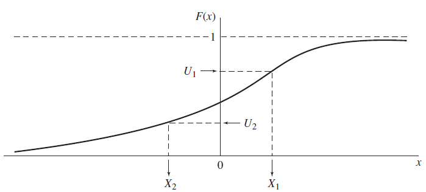
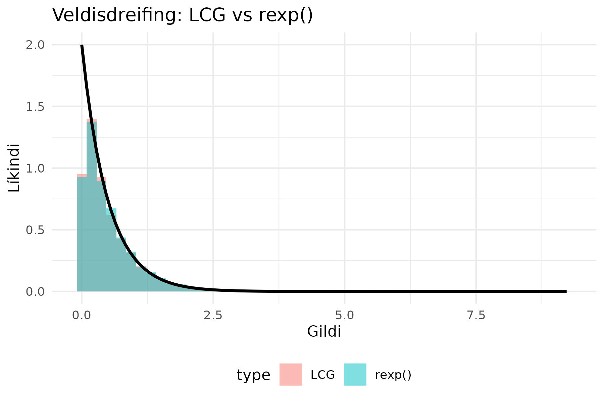
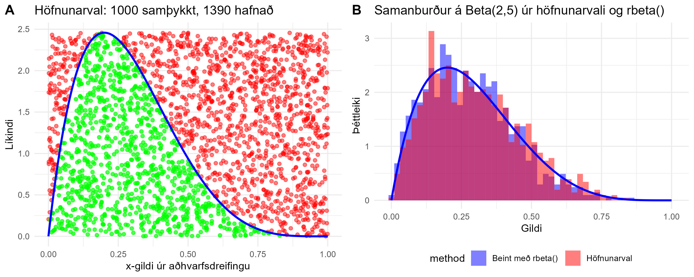
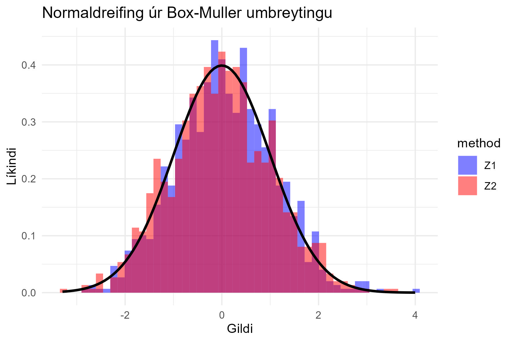

# Hendingar og slembiframkallarar

## Línulegur samfelldur slembiframkallari (LCG)

LCG (e. Linear Congruential Generator) er algeng reikniaðferð sem býr til *gervi hendingar* (e.
pseudo random) sem eru jafndreifðar:

$$ Z_i = (a Z_{i-1} + c) \mod m $$

Þar sem:

- $$m$$ er mótulið (hámarksfjöldi gilda),
- $$a$$ er margfaldari,
- $$c$$ er viðbót,
- $$Z_0$$ er fræsgildi (e. seed) þ.e. upphafsgildi.

### Tímabil og mikilvægi góðrar stillingar

Línulegir samfelldir slembiframkallarar geta haft *mismunandi lengd á tímabilum sínum*, sem ákvarðar
hversu margar hendingar er hægt að framleiða áður en þær byrja að endurtaka sig.

Ef $$m$$, $$a$$, og $$c$$ eru ekki rétt valin, getur LCG orðið *ófullnægjandi* vegna:

- Stutts tímabils (endurtekur sig fljótt).
- Hárrar fylgni milli framleiddra talna.
- Ójafnrar dreifingar yfir bilið $$[0,1]$$.

Til að tryggja *góðan LCG-framkallara* eru nokkrar vel þekktar stillingar notaðar:

| Nafn                                       | $$a$$      | $$c$$      | $$m$$          |
|--------------------------------------------|------------|------------|----------------|
| **Numerical Recipes** (Press et al., 1992) | 1664525    | 1013904223 | $$2^{32}$$     |
| **MINSTD** (Park & Miller, 1988)           | 16807      | 0          | $$2^{31} - 1$$ |
| **GCC** `rand()`                           | 1103515245 | 12345      | $$2^{31}$$     |

LCG reikniritið sem notað er í GCC `rand()` kemur frá eldri BSD-kerfum og er útfært í GNU C
Library (glibc). Það hefur stutt tímabil og er þekkt fyrir að framleiða tölur með fylgni á milli
þeirra, svo það er ekki mælt með því fyrir vísindalega hermun. Sjá glibc source code og ISO C
Standard fyrir frekari upplýsingar.

📖 **Tilvísun**: Law (2007), kafli **7.2**

### **Jöfn (rétthyrnd) dreifing**

Jöfn/rétthyrnd dreifing (*continuous uniform distribution* eða *rectangular distribution*) lýsir
sér þannig að öll gildi á ákveðnu bili eru jafnlíkleg.

LCG-aðferðin er oft notuð til að búa til hendingar sem fylgja *jöfnu dreifingu á bilinu $$[0,1]$$*.
Til að athuga hvort slembitöluframkallari virki rétt, má bera saman:

- LCG-framleiðslu á jöfnum hendingum við
- Innbyggða `runif()` fallið í R sem notar nútíma slembitöluframkallara (*Mersenne Twister*).

---

## Umbreyting á jafndreifðum hendingum í aðrar slembidreifingar

Hendingar sem eru framleiddar með LCG fylgja **jafnri dreifingu**, en í mörgum tilfellum viljum við
fá slembibreytur sem fylgja annarri dreifingu, t.d. **normal-, veldis- eða Poisson-dreifingu**.
Til þess eru notaðar eftirfarandi aðferðir:

### 1. Andhverfu-aðferðin (Inverse Transform Method)

- Hentar fyrir dreifingar með einfalda andhverfu af dreififalli (cumulative distribution function,
  CDF).
- Notuð til að umbreyta jafndreifðum slembigildum $$ U \sim U(0,1) $$ í slembigildi með tiltekinni
  dreifingu.

📖 **Tilvísun**: Law (2007), kafli **8.2.1**

#### Hvernig virkar aðferðin?

Andhverfu-aðferðin byggir á þeirri staðreynd að ef við höfum samfellt dreififall $$F(x)$$,
þá er hægt að finna gildi $$X$$ sem fylgir þessari dreifingu með eftirfarandi skrefum:

1. Veljum slembigildi $$U$$ úr jafndreifingu á bilinu $$[0,1]$$.
2. Finnum $$X$$ með lausn á jöfnunni:  
   $$ X = F^{-1}(U) $$
3. Þá fylgir $$X$$ dreifingunni með dreififall $$F(x)$$.

Í myndinni hér að ofan:

- $$U_1$$ er valið úr jafndreifingu á $$[0,1]$$ (t.d. með LCG-aðferðinni).
- Við flettum upp á $$X_1$$ með því að finna samsvarandi gildi þar sem $$F(X_1) = U_1$$.
- Sama gildir fyrir $$U_2$$ og $$X_2$$.
- Þessi aðferð virkar fyrir hvaða samfellt dreifða slembistærð sem er, að því gefnu að $$F(x)$$
  sé andhverfanlegt.

#### Notað fyrir veldisdreifingu

Ef við viljum búa til slembibreytur með **veldisdreifingu**, þar sem dreififallið er:

$$  F(x) = 1 - e^{-\lambda x} $$

þá er andhverfa þess:

$$  X = -\frac{\ln U}{\lambda} $$

þar sem $$\lambda = \frac{1}{\mu}$$ og $$\mu$$ er meðaltal veldisdreifingarinnar.

> Þetta sýnir hvernig **veldisdreifð slembigildi** er hægt að framleiða úr jafndreifðum gögnum með
> **andhverfu-aðferðinni**. Aðferðin er sérstaklega hentug fyrir dreifingar þar sem hægt
> er að leysa andhverfu af dreififalli á einfaldan hátt.

---

### 2. Höfnunarval (Acceptance-Rejection Sampling)

- Notað ef andhverfa dreififalls (CDF) er erfið eða ekki til.
- Velur aðhvarfsdreifingu (proposal distribution) sem auðvelt er að búa til og líkist
  markdreifingunni.
- Hafnar eða samþykkir slembigildi eftir ákveðnu viðmiði, sem byggist á líkindahlutfalli
  markdreifingarinnar og aðhvarfsdreifingarinnar.

📖 **Tilvísun**: Law (2007), kafli **8.2.4**

#### Hvernig virkar höfnunarval fyrir Beta(2,5) dreifingu?

Beta(2,5) dreifingin er skekkt til hægri og hefur þéttleikafall sem erfitt er að mynda með einföldum
umbreytingum frá jafndreifingu. Þar sem *engin einföld andhverfa er til staðar* fyrir dreififall 
Beta dreifingar, er höfnunarval góð aðferð til að mynda hana.

Hér notum við jafndreifða aðhvarfsdreifingu á bilinu $$[0,1]$$, því Beta dreifingin er bundin
við sama bil. Höfnunarval virkar með því að:

1. Velja slembigildi  $$U_1 $$ úr jafndreifingu á bilinu  $$[0,1] $$ (kandidat).
2. Velja annað slembigildi  $$U_2 $$ úr jafndreifingu á bilinu  $$[0, M] $$, þar sem  $$M $$ er
   hámarksgildi þéttleikafallsins  $$f(x) $$ fyrir Beta(2,5).
3. Ef  $$U_2 < f(U_1) $$, þá samþykkjum við  $$U_1 $$ sem gildi úr Beta(2,5) dreifingunni.
4. Ef ekki, þá endurtökum við ferlið þar til nægileg mörg gildi hafa verið samþykkt.

Þessi aðferð tryggir að framleidd gildi fylgi réttri dreifingu án þess að við þurfum að nota sérhæfð
`rbeta()` fall í R.

---

### 3. Box-Muller aðferðin

- Notuð til að búa til normaldreifð slembigildi.
- Breytir tveimur jöfnum slembitölum í tvær normaldreifðar stærðir:

  $$ Z_1 = \sqrt{-2 \ln U_1} \cdot \cos(2\pi U_2) $$
  og 
  $$ Z_2 = \sqrt{-2 \ln U_1} \cdot \sin(2\pi U_2) $$

þar sem $$ U_1, U_2 \sim \mathcal{U}[0,1] $$.

📖 **Tilvísun**: Law (2007), kafli **8.3.6**

---

## Heimildir

- **Law, A. M.** (2007). *Simulation Modeling and Analysis* (4th ed.). McGraw-Hill.
- **Park, S. K., & Miller, K. W.** (1988). *Random number generators: Good ones are hard to find*.
  Communications of the ACM, 31(10), 1192-1201. https://doi.org/10.1145/63039.63042
- **Teukolsky, S. A., Flannery, B. P., Press, W., & Vetterling, W.** (1992). *Numerical Recipes in
  C*. SMR, 693(1), 59-70.
- GNU C Library (glibc), rand() implementation. ISO C Standard.