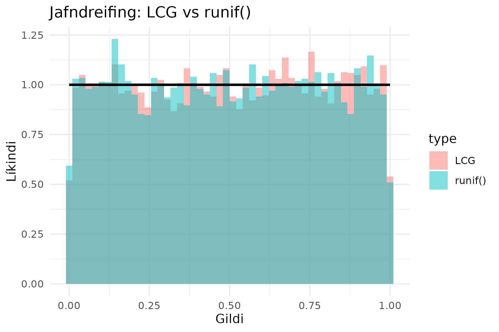

# Hendingar og LCG-aðferðin

## Hvað eru hendingar í hermun?

Hermilíkön þurfa hendingar til að líkja eftir óvissu í raunheiminum. Dæmi eru:

- Komutími viðskiptavina í biðröð.
- Bilunartími véla í verksmiðju.
- Eftirspurn eftir vörum.

### Línulegur samfelldur slembiframkallari (LCG)

LCG (*Linear Congruential Generator*) er algeng reikniaðferð sem býr til *gervi hendingar*
(e. pseudo random) með jöfnu formi:

$$
Z_i = (a Z_{i-1} + c) \mod m
$$

Þar sem:

- $$m$$ er mótulið (hámarksfjöldi gilda),
- $$a$$ er margfaldari,
- $$c$$ er viðbót,
- $$Z_0$$ er fræsgildi (e. seed) þ.e. upphafsgildi.

### Tímabil og mikilvægi góðrar stillingar

Línulegir samfelldir slembiframkallarar geta haft *mismunandi lengd á tímabilum sínum*, sem
ákvarðar hversu margar hendingar er hægt að framleiða áður en þær byrja að endurtaka sig.

Ef $$m$$, $$a$$, og $$c$$ eru ekki rétt valin, getur LCG orðið *ófullnægjandi* vegna:

- Stutts tímabils (endurtekur sig fljótt).
- Hárrar fylgni milli framleiddra talna.
- Ójafnrar dreifingar yfir bilið $$[0,1]$$.

Til að tryggja *góðan LCG-framkallara* eru nokkrar vel þekktar stillingar notaðar:

| Nafn                                       | $$a$$      | $$c$$      | $$m$$          |
|--------------------------------------------|------------|------------|----------------|
| **Numerical Recipes** (Press et al., 1992) | 1664525    | 1013904223 | $$2^{32}$$     |
| **MINSTD** (Park & Miller, 1988)           | 16807      | 0          | $$2^{31} - 1$$ |
| **GCC rand()**                             | 1103515245 | 12345      | $$2^{31}$$     |

Í kafla 7.2 í Law (2007) er fjallað um hvernig *stórt gildi á $$m$$ og val á $$a$$ með réttum
eiginleikum* tryggir *löng tímabil og betri gæði slembitalna*.

---

## **Jöfn (rétthyrnd) dreifing**

Jöfn dreifing (*continuous uniform distribution* eða *rectangular distribution*) lýsir sér þannig að
öll gildi á ákveðnu bili eru jafn líkleg.

LCG-aðferðin er oft notuð til að búa til hendingar sem fylgja *jöfnu dreifingu á bilinu $$[0,1]$$*.
Til að athuga hvort slembitalnaframleiðari virki rétt, má bera saman:

- **LCG-framleiðslu á jöfnum hendingum** við
- **Innbyggða `runif()` fallið í R** sem notar nútíma slembitalnaframleiðara (*Mersenne Twister*).

Myndin sýnir *samanburð á stöplariti LCG og `runif()`* með yfirlagðri rauðri línu sem
sýnir fræðilega rétthyrnda dreifingu.

---

## Veldisdreifing (exponential distribution)

Veldisdreifing er algeng í hermun og lýsir sér þannig að *líkur á ákveðnum tíma milli atburða
minnka með stærð gildisins*.

Til að umbreyta jöfnum hendingum í veldisdreifingu er hægt að nota andhverfu-hlutafalls-aðferðina:

$$ X = -\frac{\ln U}{\lambda} $$

Þar sem:

- $$U$$ er jafndreifð hending á bilinu $$[0,1]$$,
- $$\lambda$$ er hraða stikinn (rate parameter).

R hefur innbyggt fall, `rexp()`, sem býr til veldisdreifð gögn. Til samanburðar var **LCG hendingum
umbreytt í veldisdreifingu og borin saman við `rexp()`**.

Myndin sýnir *samanburð á stöplariti LCG og `rexp()`*, þar sem rauða línan táknar
fræðilega veldisdreifingu.

## Heimildir
- **Law, A. M.** (2007). *Simulation Modeling and Analysis* (4th ed.). McGraw-Hill.
- **Park, S. K., & Miller, K. W.** (1988). *Random number generators: Good ones are hard to find*. 
  Communications of the ACM, 31(10), 1192-1201. https://doi.org/10.1145/63039.63042  
- **Teukolsky, S. A., Flannery, B. P., Press, W., & Vetterling, W.** (1992). *Numerical Recipes in 
  C*. SMR, 693(1), 59-70.
- GNU C Library (glibc), rand() implementation. ISO C Standard.