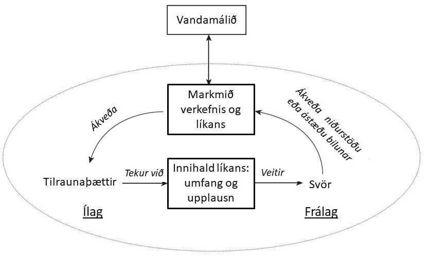
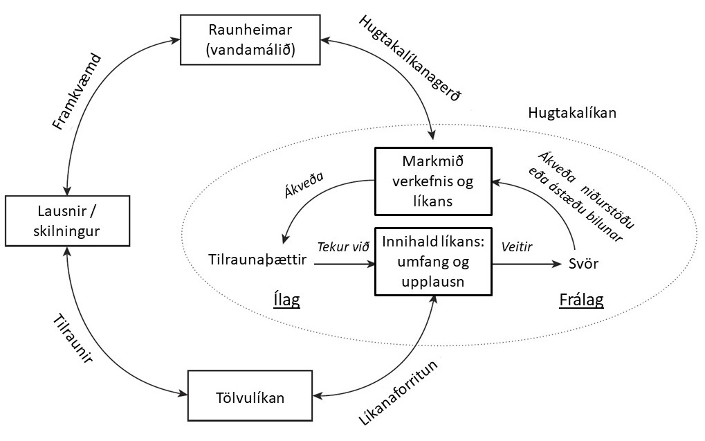

---

description: >-
  Ferli við að þróa og nota hugtakalíkön til hermunarlausna, með áherslu á aðferðir og kröfur fyrir árangursríka líkanagerð.

---

Hermun er tól til að aðstoða við ákvörðunartöku á ákveðnu vandamáli í ákveðnu samhengi. Til þess
þurfum við að komast úr vandamálinu í raunheimi yfir í líkan sem við getum keyrt í tölvu. Eins og
áður hefur komið fram (sjá mynd
[Kerfissýn á lausnir með líkönum](../simulation_overview/model_development.md#mitroff-kerfissýn))
þá þurfum við fyrst að lýsa hvað á að gera og svo getum við forritað vísindalíkan. Þetta millistig
er hugtakalíkan, sem getur verið á mismunandi stigum, frá mjög einföldu upp í viðamikil. Þessi kafli
fjallar um inntak hugtakalíkana og hvað þarf að hafa í huga við gerð þeirra.

## Hugtakalíkan

Hugtakalíkan (e. conceptual model) er lýsing á því hvað þarf að taka með úr raunheimi áður en við
gerum líkan í líkanaheimi. Hugtakalíkan er vörpun úr raunheimi í óhlutbundna lýsingu (e.
abstraction) þar sem aðalatriðum kerfis er lýst sem og markmiðum rannsóknar. Eftir það er hægt að
varpa hugtakalíkani yfir í vísindalíkan (eða hermilíkan), oft með milliskrefum í 
ferlalýsingum og atburðaritum.

Hugtakalíkan hefur eftirfarandi einkenni:

> Hugtakalíkan er einfölduð lýsing (e. representation) af raunheimi.
> Það er óháð líkanakóða (e. model code) og hugbúnaði.
> Viðhorf bæði viðskiptavinar og líkanasmiðs (e. modeller) skipta máli í hugtakalíkangerð.

### Ferli hugtakalíkanagerðar

Gerð hugtakalíkans felur í sér að færast úr raunheimi í óhlutbundna lýsingu þar sem lykilþættir eru
greindir og settir fram á skýran hátt. Þetta ferli er ítrunarlegt og endurtekningarlegt þar sem
líkan er stöðugt yfirfarið og betrumbætt í gegnum rannsóknina.

Í þessu kveri notum við hugtakalíkan eins og því er lýst í [Law (2007)](#heimildir)
og [Robinson (2010)](#heimildir). Útgáfa Law (2007) er einföld og birtist sem forsenduskjal, en
útgáfa Robinson (2010) er umfangsmeiri og óhlutbundnari.

Hugtakalíkan inniheldur:

- **Markmið líkans** sem ákvarða hvaða þættir skipta máli.
- **Tilraunaþætti** (e. experimental factors) sem skilgreina hvaða inntaksbreytur eru mikilvægar.
- **Umfang líkans** (e. scope of model), sem afmarkar hvað er tekið með.
- **Upplausn líkans** (e. level of detail), sem ákvarðar hversu nákvæm lýsingin er á sérhverjum
  íhlut.
- **Forsendur** (e. assumptions), sem taka á óvissu og einföldunum.
- **Svör** (e. responses) sem eru mælanleg frálög líkansins.

### Forsenduskjal

Til að koma í veg fyrir samskiptavandamál og skort á samræmi þarf að skrá allar mikilvægar
upplýsingar. Þetta skjal er nefnt forsenduskjal í [Law (2007)](#heimildir) og þjónar sem lykilhluti
hugtakalíkans. Það er lykilatriði fyrir vel heppnaða líkanagerð að þessi gögn séu vel skjalfest og
gagnsæ.

> Forsenduskjalið inniheldur yfirlit yfir markmið, ílag og frálag líkansins, ásamt ferlalýsingum,
> lýsingu á undirkerfum, einföldunum, takmörkunum og samantekt á gagnasöfnum.

## Hugtakamótun

Hugtakamótun (e. conceptualization) snýst um að velja viðeigandi hugtök til að lýsa raunheimi í
líkanaheimi. Ferlið við hugtakalíkanagerð felur í sér að:

- Skilgreina markmið verkefnisins og tryggja að þau samsvari raunverulegu vandamálinu.
- Ákvarða hvaða frálög líkanið skilar og hvaða inntaksbreytur hafa áhrif.
- Greina hvaða hlutar raunheimsins skipta máli fyrir líkanið (umfang) og hversu nákvæm lýsing þeirra
  þarf að vera.
- Greina forsendur og mögulegar einfaldanir til að auðvelda líkanagerðina.

### Kröfur til hugtakalíkana

Vel skilgreint hugtakalíkan uppfyllir eftirfarandi skilyrði:

- **Gildi (e. validity):** Tryggir að hugtakalíkanið sé nægjanlega nákvæmt fyrir verkefnið.
- **Trúverðugleiki (e. credibility):** Tryggir að líkan sé sannfærandi fyrir viðskiptavini og
  notendur.
- **Nytsemi (e. utility):** Líkanið þarf að gagnast sem ákvarðanatæki í verkefninu.
- **Framkvæmanleiki (e. feasibility):** Það þarf að vera raunhæft að þróa líkanið með aðgengilegum
  gögnum og auðlindum.

---

## Heimildir

- [Law (2007)](#heimildir) *Simulation Modeling and Analysis* (4th ed.). McGraw-Hill.
- [Robinson (2010)](#heimildir) *Conceptual Modeling for Simulation: Definition and Requirements*.
  In S. Robinson, R. Brooks, K. Kotiadis, & D.-J. van der Zee (Eds.), *Conceptual Modeling for
  Discrete-Event Simulation*. CRC Press.