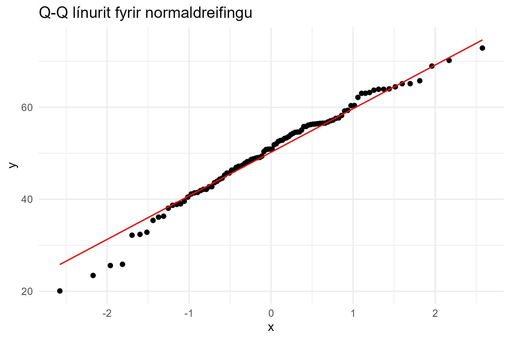

Ferlið við að velja viðeigandi líkindadreifingu fyrir gögn er mikilvægt skref í tölfræðilegri
greiningu. Rétt dreifing getur bætt líkanagerð og leitt til nákvæmari niðurstaðna.

Val á dreifingu skiptist í þrjú lykilskref:

1. **Ágiskun á fjölskyldu af dreifingum** – Gróf flokkun byggð á lögun gagna.
2. **Sennileikamat (*Maximum Likelihood Estimation, MLE*) á stikum** – Aðferð til að áætla stika
   dreifingarinnar.
3. **Mat á hversu vel tókst að máta dreifingu** – Prófanir á hversu vel dreifingin passar við
   gögnin.

---

## Ágiskun á fjölskyldu af dreifingum

Við val á líkindadreifingu er gott að skoða grunnupplýsingar um gögnin:

- **Neðsta og hæsta gildi**: Metur svið gagna.
- **Meðalgildi**: Gefur vísbendingu um miðju dreifingarinnar.
- **Miðgildi**: Minni áhrif frá útgildum en meðaltal.
- **Fervik (*variance*)**: Mælir breytileika í gögnunum.
- **Skeifni (*skewness*)**: Mælir hvort dreifingin er ósamhverf.
- **Fráviksstuðull (*coefficient of variation, CV*)**: Hentar fyrir samfelldar dreifingar.
- **Lexis hlutfall**: Hentar fyrir strjálar dreifingar.

Til dæmis ef dreifingin er samfelld og $$CV \approx 1$$ þá er hugsanlega um
veldisdreifingu að ræða, sjá nánari umfjöllun í kafla 6.4.1 í Law (2007).

### R-kóði til að reikna þessa tölfræðilegu eiginleika:

```r
set.seed(42)
data <- rnorm(100, mean = 50, sd = 10) # Slembigögn með normaldreifingu

summary_stats <- data.frame(
  Min = min(data),
  Max = max(data),
  Mean = mean(data),
  Median = median(data),
  Variance = var(data),
  Skewness = e1071::skewness(data)
)
```

| Lágmark (Min) | Hámark (Max) | Meðaltal (Mean) | Miðgildi (Median) | Fervik (Variance) | Skeifni (Skewness) |
|---------------|--------------|-----------------|-------------------|-------------------|--------------------|
| 20.0691       | 72.86645     | 50.32515        | 50.89797          | 108.4424          | -0.4689891         |

---

## Myndrænar aðferðir til að skoða lögun dreifingar

Myndræn framsetning getur hjálpað við val á dreifingu. Hér eru tvær gagnlegar aðferðir:

### 1. **Stuðlarit (*Histogram*)** til að skoða lögun gagna:

```r
k <- floor(1 + log2(length(data))) # Regla Sturges fyrir fjölda stöpla í stöplariti
ggplot(data.frame(data), aes(x = data)) +
  geom_histogram(aes(y = ..density..), bins = k, fill = "lightgrey", color = "black") +
  geom_density(color = "red", size = 1) +
  labs(title = "Stöplarit með þéttleikafalli", x = "Gildi", y = "Þéttleiki") +
  theme_minimal()
```


Myndin sýnir stöplarit með þéttleikafalli fyrir slembigögn með normaldreifingu. Fjöldi stöpla er
reiknað út frá reglu Sturges. Raundreififallið, $$F(x)$$ fyrir gögnin er sýnt með rauðri línu.

#### Fjöldi stöpla í stöplariti

Til eru nokkrar leiðir til að ákvarða fjölda stöpla í stöplariti, g.r.f. að
$$n$$ er fjöldi gilda í gagnasafninu:

- **Regla Sturges**: $$ k = \lfloor 1 + \log_2(n)  \rfloor $$
- **Regla Scott's normal reference**, $$k = \lfloor 3.5 \hat{\sigma} / \sqrt[3]{n}\rfloor$$
- **Regla Freedman Diaconis**: $$k = \lfloor 2\times  IQR(X) / \sqrt[3]{n}\rfloor$$ þar sem IQR
  er fjarlægð milli fjórðungsmarka (e. interquartile range, þ.e. $$IQR=Q_3-Q_1$$). Það er minna
  viðkvæmt fyrir útlögum en Regla Scott's.

#### Aðrar athuganir

- Æskilegt að vera með bil með sömu breidd, $$\Delta b = b_{j}-b_{j-1}$$ sem gæti þýtt að henda 
  þurfi út gildum sem eru óhemjustór eða lítil.

- $$P(b_{j-1}\le X < b_j) = \int_{b_{j-1}}^{b_j}f(x)dx=\Delta b f(y)\approx h_j$$ 
  þar sem $$y\in(b_{j-1},b_j)$$

- Ef stöplarit er með fleiri en eina kryppu getur verið nauðsynlegt að
  nota blöndu af fleiri en einni dreifingu, t.d. tvær kryppur:
  $$f(x) = p_1 f_1(x) + p_2 f_2(x)$$

### 2. **Q-Q línurit** til að meta hvort gögn fylgi normaldreifingu:

```r
ggplot(data.frame(sample = data), aes(sample = sample)) +
  stat_qq() +
  stat_qq_line(color = "red") +
  labs(title = "Q-Q línurit fyrir normaldreifingu") +
  theme_minimal()
```



Á myndinni sést Q-Q línurit fyrir slembigögn með normaldreifingu. Ef punktar liggja á rauðu línunni
er líkindi á því að gögnin fylgi normaldreifingu.


---

## Næstu skref: Mat á hversu vel dreifing passar við gögn

Þegar búið er að velja fjölskyldu dreifingar má nota tölfræðilegar prófanir (t.d. Kolmogorov-Smirnov
próf eða Anderson-Darling próf) til að sannreyna dreifinguna.
