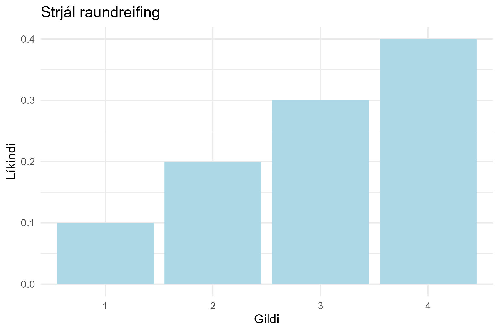
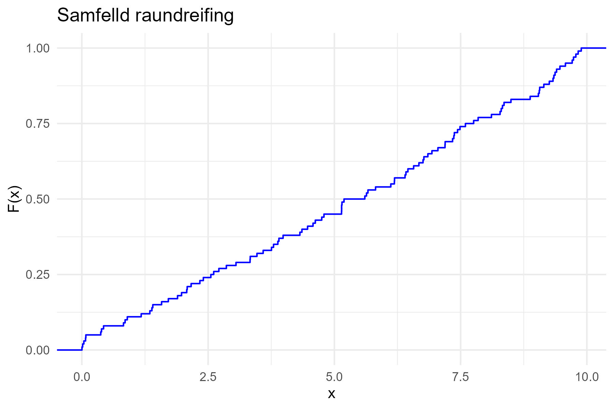
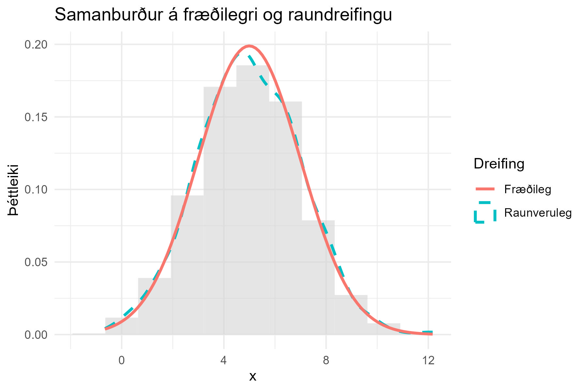

# Raundreifingar

Stundum höfum við áhuga á að láta gögnin sjálf skilgreina dreifinguna og ekki nota fræðilegt
dreififall. Þetta getur verið mikilvægt þegar engin fræðileg líkön passa vel við gögnin.

## Strjál raundreifing

Strjál raundreifing á sér stað þegar slembibreyta getur aðeins tekið ákveðin stök gildi.
Hægt er að reikna líkindi hvers gildis með:

- Líkindi $$p(x)$$ eru einfaldlega hlutfall gildanna $$X_i$$ sem eru jafnt og $$x$$.
- Í R má reikna þetta með því að telja tíðni hvers gildis í gagnasafninu og deila með heildarfjölda
  mælinga.

Eftirfarandi R-kóði sýnir hvernig hægt er að reikna og teikna strjála raundreifingu:

```r
library(tidyverse)
# Strjál raundreifing
X <- c(1, 2, 2, 3, 3, 3, 4, 4, 4, 4)
df_strjal <- as_tibble(table(X)) %>%
  rename(x = X, freq = n) %>%
  mutate(prob = freq / sum(freq))
ggplot(df_strjal, aes(x = as.factor(x), y = prob)) +
  geom_col(fill = "lightblue") +
  labs(title = "Strjál raundreifing", x = "Gildi", y = "Líkindi") +
  theme_minimal()
```


Myndin sýnir tíðnidreifingu fyrir strjálar slembibreytingar. Hver súla táknar líkindi þess að
ákveðið gildi komi fyrir í gögnunum.

## Samfelld raundreifing

Fyrir samfelldar dreifingar er hægt að reikna dreififallið sem:

$$
F(x) = \begin{cases}
0, & \text{ef } x < X_{(1)} \\
\frac{i-1}{n-1} + \frac{x - X_{(i)}}{(n-1)(X_{(i+1)} - X_{(i)})}, & \text{ef } X_{(i)} \leq x < X_{(i+1)} \\
1, & \text{ef } X_{(n)} \leq x
\end{cases}
$$

Eftirfarandi R-kóði sýnir hvernig hægt er að reikna og teikna samfellda raundreifingu:

```r
set.seed(42)
X_samfelld <- runif(100, min = 0, max = 10)
ggplot(data.frame(X_samfelld), aes(x = X_samfelld)) +
  stat_ecdf(geom = "step", color = "blue") +
  labs(title = "Samfelld raundreifing", x = "x", y = "F(x)") +
  theme_minimal()
```



Bláa línan sýnir uppsafnað dreififall, $$F(x)$$ þar sem gildi safnast upp með hækkandi $$x$$.

## Samanburður á raundreifingum

Til að bera saman dreifingar notum við bæði myndrænar og tölfræðilegar aðferðir. Eitt dæmi er að
bera saman raunverulegt þéttleikafall og fræðilega dreifingu.

Eftirfarandi R-kóði sýnir hvernig við getum borið saman tíðnidreifingu við normal dreifingu:

```r
## Samanburður á raundreifingum og líkindum
n <- 1000
X_norm <- rnorm(n, mean = 5, sd = 2)

k <- round(1 + log2(n)) # Regla Sturges fyrir fjölda stöpla
ggplot(data.frame(X_norm), aes(x = X_norm)) +
  geom_histogram(aes(y = ..density..), fill = "lightgrey", bins = k, alpha = 0.6) +
  geom_density(aes(color = "Raunveruleg"), size = 1, linetype = "dashed") +
  stat_function(fun = dnorm, args = list(mean = mean(X_norm), sd = sd(X_norm)),
                aes(color = "Fræðileg"), size = 1) +
  labs(title = "Samanburður á fræðilegri og raundreifingu", x = "x", y = "Þéttleiki", color="Dreifing") +
  theme_minimal()
```


Á myndinni sést samanburður á raunverulegum gögnum og fræðilegri dreifingu. Rauða línan sýnir 
fræðilega normal dreift fall með meðaltali 5 og staðalfráviki 2. Bláa línan sýnir þéttleikafall
raunverulegra mælinga. Ljósa súlurnar sýna stöplarit af mælingunum. Fjöldi stöpla er reiknað út 
frá *reglu Sturges*.

> **Athugasemd:** Ef fræðileg dreifing passar illa við gögnin getur verið betra að nota raunmælingar
> til að móta líkindalíkan.

---

## Mikilvægi raundreifinga

- Henta vel þegar engin fræðileg líkön passa við gögnin.
- Gefa betri mynd af raunverulegum dreifingum í gögnum.
- Hægt að nota til að sannreyna hvort fræðileg dreifing sé viðeigandi.