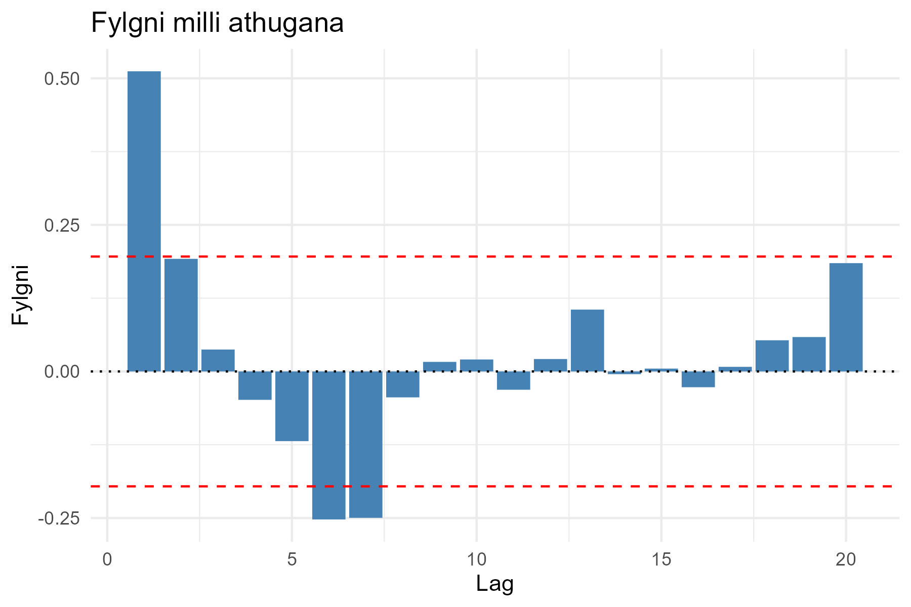

# Óhæði gagna og fylgni

Ein mikilvæg forsenda sem margar tölfræðilegar aðferðir gera ráð fyrir er að athuganir séu óháðar.
Ef gögn eru háð hvert öðru getur það haft áhrif á ályktanir sem dregnar eru af tölfræðilegum prófum.

## Myndrænar aðferðir til að meta óhæði

Til eru tvær algengar leiðir til að meta hvort gögn séu óháð:

### 1. Reikna fylgni milli athugana

Ef gögn eru óháð ætti fylgnin $\hat{\rho}_j$ að vera nálægt núlli. Hægt er að teikna fylgni á móti
tölu skrefa $j$ og skoða hvernig hún hegðar sér yfir tíma.

```r
# Búa til slembirunu með AR(1) ferli
set.seed(42)
X <- arima.sim(model = list(ar = 0.5), n = 100)

# Reikna ACF og umbreyta í gagnaramma fyrir ggplot
acf_data <- acf(X, plot = FALSE)
acf_df <- data.frame(
  Lag = acf_data$lag[-1],   # Sleppum fyrsta gildinu (lag 0)
  Fylgni = acf_data$acf[-1]
)

# Reikna 95% öryggismörk fyrir ACF
ci <- qnorm(0.975) / sqrt(length(X))

# Teikna með ggplot
ggplot(acf_df, aes(x = Lag, y = Fylgni)) +
  geom_col(fill = "steelblue") +  # Súlurit fyrir fylgni
  geom_hline(yintercept = c(ci, -ci), linetype = "dashed", color = "red") + # Öryggismörk
  geom_hline(yintercept = 0, linetype = "dotted") + # Lína við 0
  labs(title = "Fylgni milli athugana", x = "Lag", y = "Fylgni") +
  theme_minimal()
```



Þessi mynd sýnir sjálffylgnifall fyrir slembirunu sem fylgir sjálffylgniferli ($$AR(1)$$ með stuðul
0.5). Á lóðrétta ásnum er fylgnistuðullinn, sem mælir hversu sterk tengsl eru milli núverandi og
fyrri athugana, og á lárétta ásnum eru mismunandi tölu skrefa (lags). Bláu súlurnar sýna fylgni
fyrir hverja tölu skrefa, svarta strikið táknar grunnlínuna þar sem engin fylgni er til staðar og
rauðu brotalínurnar tákna 95% öryggisbil, sem skilgreina svæðið þar sem fylgnin gæti verið af
tilviljun. Út frá myndinni sést að fyrstu gildin hafa jákvæða fylgni, sem smám saman minnkar og
verður neikvæð, en þetta bendir til þess að núverandi gildi hafi áhrif á næstu skref í röðinni, sem
er dæmigert fyrir sjálffylgniferli.

### 2. Dreifirit eða punktaský (e. scatter plot)

Ef gögn eru óháð ættu punktar í dreifiritinu að dreifast jafnt án sýnilegra mynstra.

```r
set.seed(42)
X <- rnorm(100) # Slembigögn
plot(X[-length(X)], X[-1], main = "Dreifirit til að meta óhæði",
     xlab = expression(X[i]), ylab = expression(X[i + 1]), pch = 16, col = "blue")
```


Ef gögnin eru óháð ættu þau að dreifast jafnt eins og á myndinni. Ef fylgni er til staðar myndi
punktaskýið myndað greinilegt mynstur.

---

Þessar aðferðir veita sjónrænt mat á óháði gagna. Ef fylgni er veruleg eða ef punktar í dreifiritinu
mynda greinilegt mynstur gæti það bent til að gögnin séu ekki óháð og þá gæti þurft að endurskoða
forsendur greiningar.

