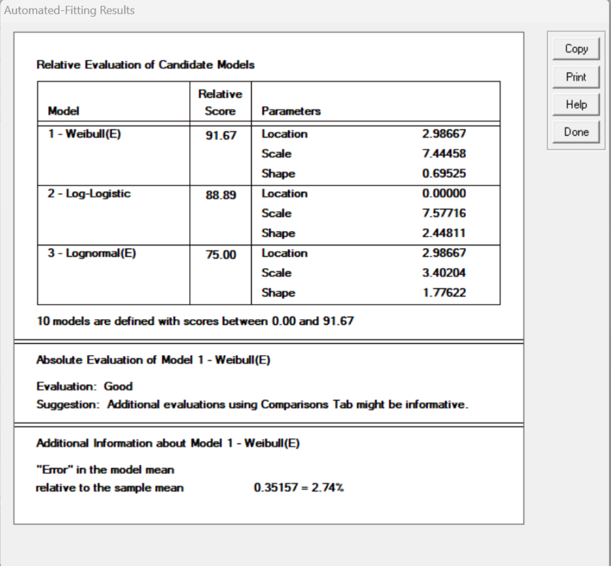
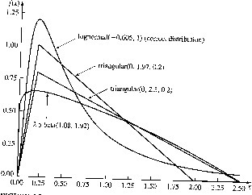
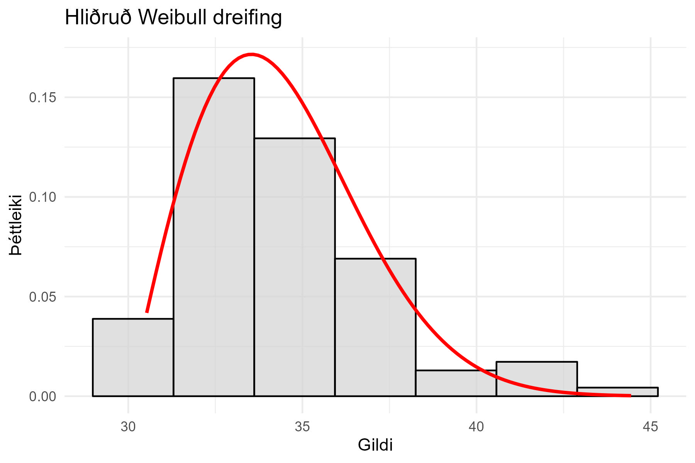

# Hliðruð dreifing (e. shifted distribution)

Stundum er hægt að bæta mát dreifingar við gögn með því að hliðra henni um staðsetningarstika, oft
táknaður með $$\gamma$$. Þetta er sérstaklega gagnlegt ef gögn hafa neðri mörk og ekki er hægt að
nota venjulega dreifingu beint. Með því að hliðra dreifingunni er tryggt að líkönin passi betur við
raunveruleg gögn.

Sem dæmi, ef $$P(X < 30) = 0$$ og við viljum nota Gamma dreifingu, þarf að hliðra dreifingunni
um $$\gamma = 30$$ með því að skipta $$x$$ í líkindafallinu $$f(x)$$ út fyrir 
$$x - \gamma$$.

---

## Mat á staðsetningarstika með aðferð Dubey (1967)

Dubey (1967) setti fram eftirfarandi formúlu til að meta hliðrun eða staðsetningarstika 
$$\gamma$$:

$$ \hat{\gamma} = \frac{X_{(1)}X_{(n)}-X_{(k)}^2}{X_{(1)}+X_{(n)}-2X_{(k)}} $$

Þar sem:

- $$X_{(1)}$$ er lægsta gildi í gagnasafninu,
- $$X_{(n)}$$ er hæsta gildi,
- $$X_{(k)}$$ er fyrsta gildi stærra en $$X_{(1)}$$, og $$k$$ er minnsta heiltala þannig að 
  $$X_{(k)} > X_{(1)}$$.

### Dæmi í R

Hér er dæmi um hvernig á að reikna staðsetningarstikann fyrir hliðraða dreifingu í R:

```r
# Slembigögn
X <- c(3, 4, 5, 4, 5, 6, 4, 80, 20, 8, 10, 25, 10, 9, 8, 8, 9)
X <- sort(X)
n <- length(X)

# Finna k
k <- which(X[-c(1, n)] > X[1])[1] + 1

# Reikna staðsetningarstika
gamma_hat <- (X[1] * X[n] - X[k]^2) / (X[1] + X[n] - 2 * X[k])
cat("Áætlað gildi fyrir γ (hliðrun):", gamma_hat, "\n")
```

Þetta veitir áætlað gildi $$\gamma=2.986667$$ fyrir hliðrunina sem hægt er að nota í frekari 
greiningu.

Til samanburðar gefur **ExpertFit** forritið frá Averill M. Law eftirfarandi gildi fyrir
staðsetningarstika:




# Þegar gögn vantar: Hvernig á að velja dreifingu?

Ef ekki eru nægileg gögn til að ákvarða dreifingu nákvæmlega, getur verið gagnlegt að nota
nálgunaraðferðir með fræðilegum dreifingum.

**Þríhyrndar og beta dreifingar** eru oft notaðar í slíkum tilfellum, en þær geta leitt til rangra
niðurstaðna. Ef gögnin liggja á bilinu $$[a,b]$$ og algengasta gildi er $$m$$, þá eru
dreifingarnar skilgreindar sem:

- **Þríhyrnd dreifing**: $$\text{Triang}(a, b, m)$$
- **Beta dreifing** með gefnu meðaltali $$\mu$$:

$$ \tilde{\alpha}_1 = \frac{(\mu-a)(2m-a-b)}{(m-\mu)(b-a)} $$

$$ \tilde{\alpha}_2 = \frac{(b-\mu) \tilde{\alpha}_1}{\mu-a} $$


### Dæmi, nálgun á lognormal dreifingu:
**Vænlegra er oft að nota Weibull eða lognormlega dreifingu**, þar sem þær veita betri nálgun
fyrir gögn sem hafa takmarkað svið eða skekkjast sterklega.



Vænlegra er að nota Weibull eða lognormal dreifingu. Til þess að
geta metið þær þarf að áætla *staðsetninga stika* $$\gamma$$, algengasta
gildi $$m$$, og hundraðasta $$q$$-hlutfallsmark (e. quantile) $$x_q$$ (e
$$100q$$th percentile). Stikinn $$\gamma$$ hegðar sér eins og neðri mörkin
$$a$$, auk þess gerum við ráð fyrir að $$0\le\gamma<m<x_q<\infty$$.

-   $$\text{\bf LN}(\gamma,\mu,\sigma^2)$$ (lognormal dreifing), sjá
    jöfnur 6.16 til 6.19 í Law (2007).

-   $$\text{\bf Weibull}(\gamma,\alpha,\beta)$$ (Weibull) sjá jöfnur 6.20
    til 6.23 í Law (2007).

Við getum hliðrað dreifingu í R með því að nota staðsetningarstika $$\gamma$$:

```r
set.seed(42)
X <- rweibull(100, shape = 2, scale = 5) + 30  # Hliðrun um gamma = 30

# Teikna Weibull dreifingu með hliðrun
library(ggplot2)
k <- floor(1 + log2(length(X)))  # Sturges regla
ggplot(data.frame(X), aes(x = X)) +
  geom_histogram(aes(y = ..density..), bins = k, fill = "lightgrey", color = "black", alpha = 0.7) +
  stat_function(fun = function(x) dweibull(x - 30, shape = 2, scale = 5),
                color = "red", size = 1) +
  labs(title = "Hliðruð Weibull dreifing", x = "Gildi", y = "Þéttleiki") +
  theme_minimal()
```


