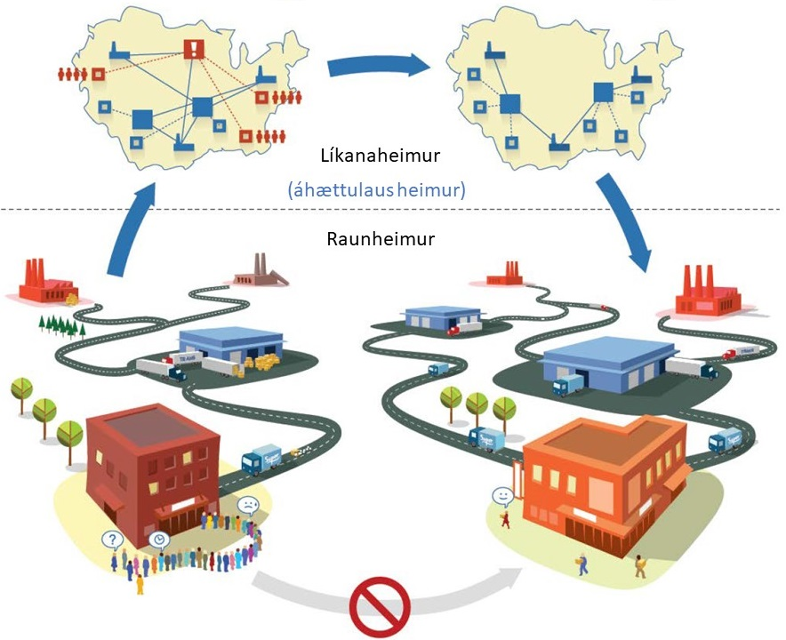

# Hermilíkön

Til eru nokkrar tegundir hermilíkana. Fyrst er ráðlegt að skilgreina hvað átt er við með hermun:

> **Hermun** *(e. simulation)* er töluleg lausnaraðferð til að draga ályktanir um tiltekið kerfi með því að nota reiknilíkan.

Í þessari skilgreiningu er kerfi *(e. system)* safn eininga sem tengjast til að ná ákveðnu markmiði og reiknilíkan *(e. model)* lýsir kerfinu sem og hegðan þess í sérhverri stöðu. Með því að nota líkanið er hægt að fá upplýsingar um hegðan kerfisins (þ.e. breytingar á stöðum) undir ýmsum kringumstæðum. Staða *(e. state)* er safn breyta sem þarf til að lýsa kerfinu á ákveðnum tímapunkti.

Hægt er að flokka líkön eftir því hvernig þau fást við nokkrar varpanir úr raunheimi yfir í líkanaheim. Þetta eru tímameðhöndlun, stöðubreytingar, óvissa, yfirsýn og tengingar atburða [Law, 2007; Russel & Norvig, 2010](#refs).

## Eiginleikar líkana

Líkön hafa mismunandi eiginleika eftir eðli kerfisins:

### Tímameðhöndlun
Þegar tekin er augnabliksmynd af kerfi er það sagt kyrrstætt *(e. static)* og ef líkanið breytist með tíma er það kvikt *(e. dynamic)*.

- **Kyrrstætt líkan**: Breytist ekki með tíma (t.d. Monte Carlo hermun).
- **Kvikt líkan**: Breytist með tíma (t.d. mismunandi komutíðni viðskiptavina eftir tíma dags).

### Stöðubreytingar
Stöðubreytingar innan kerfisins geta verið samfelldar *(e. continuous)* eða stakrænar *(e. discrete)*.

- **Samfelld kerfi**: Staða kerfisins breytist samfellt.
- **Stakræn kerfi**: Breytingar eiga sér stað á ákveðnum tímapunktum, þegar ákveðnir atburðir eiga sér stað.

### Óvissa
Ef engin óvissa ríkir eru kerfin löggeng *(e. deterministic)* en ef óvissa er til staðar verða kerfin slembin *(e. stochastic)*.

- **Löggeng kerfi**: Frálag kerfisins er 100% háð ílagi kerfisins.
- **Slembin kerfi**: Slembnir atburðir valda því að frálag breytist við hvert keyrsluferli.

### Yfirsýn
Yfirsýn kerfisins skiptist í hvort eindir *(e. agents)* hafi fulla yfirsýn eða hlutayfirsýn.

- **Full yfirsýn** *(e. fully observable)*.
- **Hlutayfirsýn** *(e. partially observable)*.

### Tenging atburða
Hvernig atburðir eru tengdir hefur áhrif á flækjustig kerfisins:

- **Atburðaumhverfi** *(e. episodic environment)*: Einföld skynjun og viðbragð.
- **Afleiðingaumhverfi** *(e. sequential environment)*: Ákvarðanir hafa áhrif á framtíðarákvarðanir.

## Stakræn atburðahermun

Líkön sem eru kvik, stakræn og slembin eru nefnd stakræn atburðahermunarlíkön *(e. discrete-event simulation models)*. Þessi líkön eru mikilvæg fyrir aðferðir sem byggja á atburðum, þar sem breytingar í kerfinu eiga sér stað þegar ákveðnir atburðir gerast.

*Mynd: Raunheimur og líkanaheimur - þýðing höfundar úr [Borshchev, 2013](#refs)*
